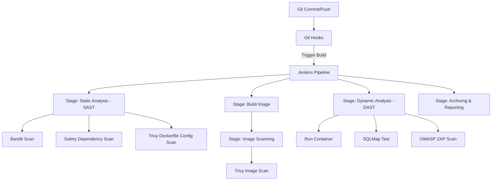

# Τεχνική Αναφορά: Αυτοματοποιημένο DevSecOps Pipeline με Git Hooks και Docker

## 1. Περιγραφή της Εφαρμογής
Η εφαρμογή που χρησιμοποιήθηκε για την αξιολόγηση του pipeline είναι ένα **Python Flask API** (που βρίσκεται στο φάκελο `app/`). Η εφαρμογή χρησιμοποιεί μια βάση δεδομένων SQLite (`users.db`) για τη διαχείριση χρηστών και προσφέρει endpoints για αναζήτηση χρηστών, έλεγχο σύνδεσης (ping) και πρόσβαση σε διαχειριστικό περιβάλλον (admin panel).

## 2. Σκόπιμα Εισαγμένες Ευπάθειες
Για τους σκοπούς της εργασίας και την αξιολόγηση του pipeline, εισήχθησαν σκόπιμα οι ακόλουθες ευπάθειες στην εφαρμογή:
*   **SQL Injection (SQLi)**: Στο endpoint `/api/user`, η είσοδος του χρήστη (`username`) ενσωματώνεται απευθείας στο ερώτημα SQL μέσω string formatting, χωρίς sanitization ή χρήση parameterized queries.
*   **Command Injection**: Στο endpoint `/api/ping`, η παράμετρος `host` εκτελείται απευθείας στο λειτουργικό σύστημα μέσω της `subprocess.check_output` με ενεργοποιημένο το `shell=True`, επιτρέποντας την εκτέλεση αυθαίρετων εντολών.
*   **Hardcoded Secrets**: Στο αρχείο `app/app.py` υπάρχουν σκληρά κωδικοποιημένα credentials (`SUPER_SECRET_API_KEY` και `ADMIN_PASSWORD`).
*   **Outdated/Vulnerable Dependencies**: Στο αρχείο `app/requirements.txt` χρησιμοποιούνται παρωχημένες εκδόσεις βιβλιοθηκών (π.χ., Flask 1.1.2, Werkzeug 1.0.1) οι οποίες περιέχουν γνωστές ευπάθειες (CVEs).
*   **Insecure Dockerfile Configuration**: Το Dockerfile της εφαρμογής εκτελείται ως χρήστης `root` (προεπιλογή) και περιέχει σκληρά κωδικοποιημένα μυστικά (`APP_SECRET_KEY`) στις μεταβλητές περιβάλλοντος `ENV`.

## 3. Περιγραφή του Git Workflow & Hooks
Υλοποιήθηκε ένα Git workflow που συνδυάζει τοπικούς ελέγχους (local checks) και ελέγχους στο CI/CD περιβάλλον:
1.  **pre-commit hook (`.githooks/pre-commit`)**: Εκτελείται τοπικά στον υπολογιστή του προγραμματιστή πριν ολοκληρωθεί το commit. Σκανάρει τα staged αρχεία με regex για την ανίχνευση hardcoded credentials και ελέγχει τη σύνταξη του κώδικα Python (`py_compile`). Αν βρει σφάλματα ή secrets, μπλοκάρει το commit.
2.  **pre-push hook (`.githooks/pre-push`)**: Εκτελείται τοπικά πριν το push. Τρέχει το στατικό εργαλείο Bandit (είτε τοπικά είτε μέσω Docker) για να εντοπίσει ευπάθειες στον κώδικα.
3.  **post-commit hook (`.githooks/post-commit`)**: Ενεργοποιείται μετά από επιτυχές commit και στέλνει ένα ασύγχρονο HTTP POST request για να ενημερώσει και να ξεκινήσει αυτόματα το Jenkins Pipeline στο `http://localhost:8082`.

## 4. Αρχιτεκτονική του Pipeline (Jenkinsfile)
Η ενορχήστρωση του pipeline γίνεται μέσω του `Jenkinsfile` που εκτελείται μέσα στο Docker container του Jenkins. Η αρχιτεκτονική περιλαμβάνει τα εξής στάδια:



### 4.1. Δυναμικό Dashboard Αναφορών (reports/dashboard.html)
Για την ολοκληρωμένη και γραφική παρουσίαση των ευρημάτων, σχεδιάστηκε και υλοποιήθηκε ένα διαδραστικό dashboard σε HTML/CSS/JS (`reports/dashboard.html`). Η σχεδίαση και η ανάπτυξη του dashboard έγιναν με τη χρήση **Τεχνητής Νοημοσύνης (AI-made)**.
Το dashboard:
*   Δεν έχει "hardcoded" δεδομένα. Αντίθετα, χρησιμοποιεί την τεχνολογία **Javascript Fetch API** για να διαβάζει δυναμικά τα JSON/Text αρχεία αναφορών των εργαλείων (`bandit_report.json`, `safety_report.json`, `trivy_config_report.json`, `trivy_image_report.json`, `zap_report.json`, `sqlmap_report.txt`).
*   Κατηγοριοποιεί τα ευρήματα ανά σοβαρότητα (Critical, High, Medium, Low) και προσφέρει φίλτρα/καρτέλες πλοήγησης για κάθε εργαλείο ξεχωριστά.
*   Κάθε φορά που εκτελείται το pipeline και ενημερώνονται οι αναφορές, το UI ανανεώνεται αυτόματα με τα νέα δεδομένα πατώντας το κουμπί **Reload Reports**.

## 5. Εργαλεία και Αιτιολόγηση Επιλογής
*   **Bandit**: Εξειδικευμένο SAST εργαλείο για Python, ιδανικό για τον γρήγορο εντοπισμό κοινών security issues (όπως shell=True, SQL expresssions).
*   **Safety**: Εργαλείο σάρωσης python dependencies που ελέγχει το `requirements.txt` έναντι μιας ενημερωμένης βάσης δεδομένων ευπαθειών.
*   **Trivy**: Πολύπλευρο εργαλείο ασφάλειας. Χρησιμοποιήθηκε τόσο για το σκανάρισμα του `Dockerfile` (Trivy Config) όσο και για το σκανάρισμα του τελικού image (Trivy Image) για ευπάθειες του λειτουργικού συστήματος.
*   **SQLMap**: Το κορυφαίο εργαλείο για τον εντοπισμό και την εκμετάλλευση ευπαθειών SQL Injection.
*   **OWASP ZAP (Baseline Scan)**: Δυναμικό εργαλείο (DAST) που σαρώνει την εφαρμογή κατά το runtime για κοινά σφάλματα ασφάλειας ιστού (Web vulnerabilities).

## 6. Πίνακας Ευρημάτων ανά Εργαλείο

| Εργαλείο | Κατηγορία Ελέγχου | Ευρήματα / CVE | Σοβαρότητα | Περιγραφή |
| :--- | :--- | :--- | :--- | :--- |
| **pre-commit** | Secrets (Static) | Hardcoded Secrets | Critical | Ανίχνευση `SUPER_SECRET_API_KEY` και `ADMIN_PASSWORD` στο `app.py`. |
| **Bandit** | SAST | B105, B608, B602 | High / Medium | Εντόπισε hardcoded credentials, SQL Injection vector και subprocess με shell=True. |
| **Safety** | Dependency | CVE-2023-30861, CVE-2023-23934 | High / Medium | Παρωχημένες εκδόσεις Flask και Werkzeug με γνωστά vulnerabilities. |
| **Trivy Config** | IaC / Docker | DS002, DS026 | Critical / High | Το Dockerfile εκτελείται ως root και περιέχει secret στο ENV instruction. |
| **Trivy Image** | Container | CVE-2023-29491, CVE-2022-40674 | High / Medium | Ευπάθειες σε συστημικά πακέτα (libsqlite3, libexpat) της base image. |
| **SQLMap** | DAST | SQL Injection | High | Επιβεβαίωσε επιτυχή SQL injection στην παράμετρο `username` του `/api/user`. |
| **OWASP ZAP** | DAST | SQLi, Command Injection, Missing CSRF/Headers | High / Medium | Εντόπισε ευπάθειες injection καθώς και έλλειψη βασικών headers ασφαλείας. |

## 7. Προτεινόμενες Διορθώσεις
1.  **Secrets Management**: Αφαίρεση των hardcoded credentials. Χρήση μεταβλητών περιβάλλοντος (`os.environ`) ή κάποιου Vault/Secret Manager κατά το runtime, αντί της αποθήκευσής τους στο Dockerfile ή στον κώδικα.
2.  **SQL Injection**: Αντικατάσταση της απευθείας συνένωσης strings με parameterized queries (χρήση placeholders `?` στη SQLite).
3.  **Command Injection**: Αποφυγή χρήσης `shell=True`. Πέρασμα των ορισμάτων ως λίστα στην `subprocess.run` ή χρήση native Python βιβλιοθηκών (π.χ., `ping3`).
4.  **Dependencies**: Αναβάθμιση των πακέτων στο `requirements.txt` στις τελευταίες ασφαλείς εκδόσεις (π.χ. Flask >= 2.3.2).
5.  **Docker Security**: 
    *   Χρήση minimal base image (π.χ. `python:3.10-alpine`).
    *   Δημιουργία και χρήση non-root χρήστη στο Dockerfile (`USER appuser`).
    *   Αφαίρεση μη απαραίτητων εργαλείων (όπως `curl`).

## 8. Περιορισμοί Υλοποίησης
*   **Local Docker Socket**: Η Jenkins pipeline εξαρτάται από την πρόσβαση στο `/var/run/docker.sock` του host συστήματος. Αυτό απλοποιεί τη διαδικασία τοπικά, αλλά σε παραγωγικά περιβάλλοντα (production) αποτελεί ρίσκο ασφάλειας (Docker-in-Docker privilege escalation).
*   **Bypass of Git Hooks**: Οι τοπικοί έλεγχοι Git hooks μπορούν να παρακαμφθούν εύκολα από τον προγραμματιστή με την παράμετρο `--no-verify`. Για τον λόγο αυτό, οι ίδιοι έλεγχοι επαναλαμβάνονται υποχρεωτικά στο Jenkins Pipeline.

## 9. Οδηγίες Αναπαραγωγής & Χρήσης
Για την εύκολη αναπαραγωγή και αξιολόγηση της εργασίας από τρίτο άτομο (π.χ. τον καθηγητή), ακολουθήστε τα παρακάτω βήματα:

1.  **Εκκίνηση Docker**: Ανοίξτε το **Docker Desktop** στον υπολογιστή σας.
2.  **Ενεργοποίηση Git Hooks**: Ανοίξτε ένα τερματικό στον φάκελο του project και εκτελέστε:
    ```bash
    git config core.hooksPath .githooks
    ```
3.  **Εκκίνηση Jenkins Server**:
    ```bash
    docker-compose up -d --build
    ```
4.  **Ρύθμιση Jenkins UI**:
    *   Μεταβείτε στη διεύθυνση `http://localhost:8082`.
    *   Συνδεθείτε (κωδικός administrator λαμβάνεται με την εντολή: `docker exec -it devsecops-jenkins cat /var/jenkins_home/secrets/initialAdminPassword`).
    *   Δημιουργήστε ένα **Pipeline Job** με όνομα `DevSecOps-Pipeline`.
    *   Στο Pipeline Definition επιλέξτε **Pipeline script from SCM**, ως SCM επιλέξτε **Git** και ορίστε ως Repository URL το: `file:///src` (διαβάζει τον mounted φάκελο του project).
5.  **Εκτέλεση Ελέγχων**:
    *   Πατήστε **Build Now** στο Jenkins για να εκτελεστούν οι στατικοί/δυναμικοί έλεγχοι.
    *   Όλα τα reports θα παραχθούν αυτόματα και θα αντιγραφούν πίσω στον φάκελο `reports/` του συστήματός σας.
6.  **Προβολή Αποτελεσμάτων**:
    *   Ξεκινήστε έναν τοπικό web server στον φάκελο του project: `python -m http.server 8000`.
    *   Ανοίξτε το `http://localhost:8000/reports/dashboard.html` και πατήστε **Reload Reports** για να δείτε τα γραφικά αποτελέσματα.

